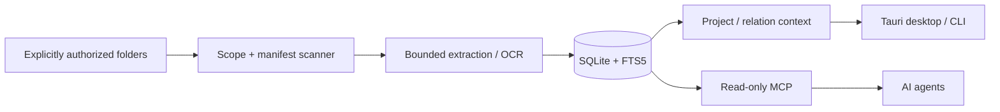

# DeskGraph

> **Graphify your computer.**

**DeskGraph is a local-first context graph for people and AI agents.** It turns explicitly authorized local folders into searchable, provenance-aware context using a Rust/Tauri desktop app, SQLite, document extraction/OCR, project and relation inference, and a narrowly scoped read-only MCP server.

> **Pre-release development build.** Use synthetic or disposable test folders and keep backups. The repository contains substantial locally verified slices, but it is **not** a public v0.1 release and should not be read as signed-package, clean-machine, Windows-runtime, or 8 GB release certification.

[Quick start](#quick-start) · [Current status](#current-status) · [Architecture](#architecture) · [Detailed documentation](docs/README.md)

## Why DeskGraph

AI agents are useful when they have context, but local computer context creates a difficult trade-off: give an agent broad filesystem access, upload private files to a remote service, or give it almost no local context at all.

DeskGraph explores a narrower model:

1. the user explicitly chooses the local folders DeskGraph may cover;
2. DeskGraph builds a local manifest and extracts bounded content with provenance;
3. local SQLite indexes make that context searchable without requiring an LLM;
4. project and relation layers add explainable structure over files;
5. AI agents can query a **read-only, scope-bounded MCP interface** instead of receiving unrestricted filesystem access.

The current core path does not require a cloud model, API key, Python, Docker, or Ollama. The product currently contains no remote content/upload client.

## What it does

- **Explicit local scope** — users authorize coverage roots rather than granting a default whole-disk scan. Native scope, exclusion, and revocation work is designed to fail closed when the platform proof is incomplete.
- **Local content intelligence** — bounded extraction for text, Markdown, source code, text-layer PDF, DOCX, PPTX, and XLSX, plus structured image metadata and a macOS OCR development path.
- **Model-free retrieval** — SQLite FTS5 trigram indexes search current metadata and extracted text with bounded snippets and explainable match sources.
- **Context graph building blocks** — Folder Profiles, correctable Project root candidates, exact-duplicate evidence, conservative numeric filename-version relations, and bounded screenshot-review candidates.
- **Read-only MCP** — an independently launched local stdio server exposes a narrowly scoped `search_files` vertical slice over completed authorized scans.
- **Safety-first organization research** — durable preview/journal/recovery foundations exist, but production filesystem execution remains unavailable until the required platform identity and safety evidence is complete.

## Architecture



**Rust owns filesystem, database, graph, retrieval, transaction, and MCP behavior. Tauri + React/TypeScript owns presentation. SQLite is the source of truth.** Optional OCR/model capabilities remain behind narrower provider boundaries rather than becoming prerequisites for the core product.

For the deeper architecture and accepted decisions, see [`docs/architecture/README.md`](docs/architecture/README.md), [`docs/planning/02_ARCHITECTURE.md`](docs/planning/02_ARCHITECTURE.md), and [`docs/architecture/adr/`](docs/architecture/adr/).

## Current status

The table below is intentionally conservative. The canonical detailed status ledger is [`docs/planning/IMPLEMENTATION_STATUS.md`](docs/planning/IMPLEMENTATION_STATUS.md).

| Capability | Current public-repo state |
| --- | --- |
| Coverage roots & manifest | Implemented development slices with explicit scope, durable scan jobs, local SQLite publication, and macOS native authorization foundations |
| Hard exclusions / root revocation | Locally verified development slices; release/platform proof is still open |
| Text / PDF / Office extraction | Implemented bounded extraction for text, Markdown, source code, text-layer PDF, DOCX, PPTX, and XLSX |
| Image metadata | Implemented bounded encoded format/dimension extraction without EXIF/GPS collection |
| OCR | macOS Apple Vision development path locally exercised; Windows provider code/cfg exists but Windows runtime/package evidence is open |
| Lexical retrieval | Implemented model-free SQLite FTS5 trigram search with bounded filters and snippets |
| Vector / hybrid retrieval | **Not implemented** |
| Project / relation graph | Partial: Folder Profiles, Project root candidates, exact duplicates, numeric filename versions, screenshot review, and bounded discovery slices |
| MCP | Partial: local read-only `search_files` vertical slice; broader tool/client/package evidence remains open |
| Watch / reconciliation | Partial: native hints and bounded recovery paths exist; this is **not** complete incremental content indexing |
| File organization | Preview/protocol/journal foundations only; production Execute/Undo/file-action adapters remain unavailable |
| Packaging / release | **Pre-release**; signed/notarized macOS and complete Windows installer/runtime acceptance remain open |

## Engineering evidence

DeskGraph keeps evidence boundaries explicit rather than treating source code as proof of release readiness.

The recorded Build Week development snapshot includes:

- **452 deterministic Rust tests** passing while explicitly excluding only two named opt-in macOS live FSEvents tests whose callback was unavailable on that host;
- **76 Vitest tests** passing as part of `pnpm check`;
- a reproducible synthetic-folder CLI demo covering scan, extraction, lexical retrieval, Project/relation evidence, and non-executable cleanup preview;
- a checked-in **10,000-file manifest benchmark** on macOS arm64: **4.489 s** initial scanner time and **4.217 s** idempotent rescan time, with 10,101 active nodes after each completed run.

See [`docs/benchmarks/M1_10K_MANIFEST_SCAN.md`](docs/benchmarks/M1_10K_MANIFEST_SCAN.md) for the environment, methodology, rejected invalid timing, and limitations.

These results are development evidence. They do **not** establish signed-package behavior, cross-platform runtime equivalence, peak-memory/8 GB certification, or public-release readiness.

## Repository shape

DeskGraph is structured as a Rust workspace rather than a single application script:

```text
apps/
├── cli
├── desktop/src-tauri
└── mcp

crates/
├── database
├── domain
├── extractors
├── identity
├── projects
├── retrieval
├── scanner
├── telemetry
├── transactions
└── watcher

tools/
├── ocr-evaluator
└── search-benchmark
```

This separation keeps filesystem/identity, retrieval, graph, transaction, and presentation concerns independently testable.

## Quick start

### Prerequisites

- Rust stable as pinned by `rust-toolchain.toml`, with `rustfmt` and `clippy`
- Node.js 24.12 or a compatible supported release
- Corepack and pnpm 11.10.0
- Tauri 2 platform prerequisites for your operating system

### Install and verify the workspace

```bash
corepack enable
corepack prepare pnpm@11.10.0 --activate
pnpm install --frozen-lockfile
cargo test --workspace
pnpm check
```

Run the privacy-safe CLI health check:

```bash
cargo run -p deskgraph-cli -- health
```

### Run the reproducible synthetic demo

Use a brand-new path; the fixture refuses to overwrite an existing destination.

```bash
cargo run -p deskgraph-cli -- fixture demo --path /absolute/new/path/deskgraph-demo
```

The fixture uses a separate synthetic database and does **not** populate the Desktop application's private app-data database.

### Start the desktop development app

```bash
pnpm desktop:dev
```

For manifest scanning, extraction, OCR, search, Project/relation review, watch reconciliation, and organization-preview commands, see [`docs/DEVELOPMENT_REFERENCE.md`](docs/DEVELOPMENT_REFERENCE.md).

## Safety model

DeskGraph treats local context and extracted text as capabilities that require explicit boundaries.

- No default whole-disk scan; local access begins from explicit user scope.
- No permanent-delete or trash-emptying capability.
- No LLM receives direct filesystem execution capability.
- Extracted document/OCR text is labeled and treated as **untrusted data**, not executable instructions.
- File-action designs require preview, policy validation, durable journaling, recovery, and revalidation before production execution can exist.
- Explicit user-facing operations may return requested local paths/snippets; ordinary structured logs are designed to omit sensitive path/content fields.
- Platform uncertainty fails closed rather than being silently treated as release support.

See [`SECURITY.md`](SECURITY.md) and the accepted ADRs for the detailed threat and platform boundaries.

## Known limitations

DeskGraph currently does **not** claim:

- public v0.1 release readiness;
- complete vector/embedding or hybrid semantic retrieval;
- complete Project membership/entity/topic inference;
- complete incremental Watch Mode and automatic incremental re-indexing;
- production filesystem Execute/Undo support;
- signed/notarized macOS release acceptance;
- complete Windows package identity, OCR runtime, or installer acceptance;
- representative multilingual OCR/search quality evaluation;
- clean-machine, hostile-process, complete cross-platform, or 8 GB release certification.

The detailed status ledger separates implemented code, local verification, CI evidence, blockers, and release gates: [`docs/planning/IMPLEMENTATION_STATUS.md`](docs/planning/IMPLEMENTATION_STATUS.md).

## Documentation

Start with [`docs/README.md`](docs/README.md) for the documentation map.

- [Detailed implementation status](docs/planning/IMPLEMENTATION_STATUS.md)
- [Development / CLI reference](docs/DEVELOPMENT_REFERENCE.md)
- [Architecture overview](docs/architecture/README.md)
- [Product definition](docs/planning/01_PRODUCT_DEFINITION.md)
- [Read-only MCP setup and limitations](docs/MCP.md)
- [10,000-file manifest benchmark](docs/benchmarks/M1_10K_MANIFEST_SCAN.md)
- [Architecture decisions](docs/architecture/adr/)
- [OpenAI Build Week evidence package](docs/HACKATHON_SUBMISSION.md)

## Development verification

The full local verification commands are:

```bash
cargo fmt --all -- --check
cargo clippy --workspace --all-targets --all-features -- -D warnings
cargo test --workspace --all-features
pnpm format:check
pnpm lint
pnpm typecheck
pnpm test
pnpm build
```

A successful local run proves only that revision and environment; release claims require the additional evidence documented in the planning/status material.

## Contributing and security

- [Contributing guide](CONTRIBUTING.md)
- [Security policy](SECURITY.md)
- [Project context](PROJECT_CONTEXT.md)

DeskGraph is licensed under [Apache-2.0](LICENSE).
